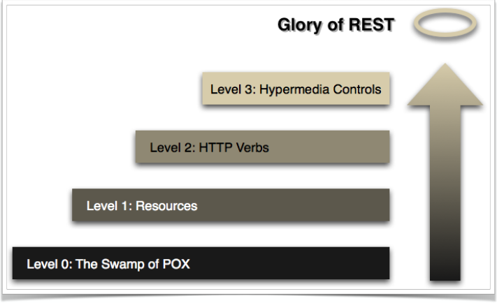

# Web 开发进阶

[TOC]

------


## 设计好的 RESTful Web Service

> “REST提供了了⼀一组架构约束，当作为⼀一个整体来应⽤用时，强调组件交互的
> 可伸缩性、接⼝口的通⽤用性、组件的独⽴立部署、以及⽤用来减少交互延迟、增
> 强安全性、封装遗留留系统的中间组件。”							
>
> ​																									- Roy Thomas Fielding

### Richardson 成熟度模型



### 如何实现 Restful Web Service

1. 
   识别资源

2. 选择合适的资源粒度

3. 设计 URI

4. 选择合适的 HTTP ⽅法和返回码

5. 设计资源的表述

#### 识别资源

1. 找到领域名词
   - 能⽤CRUD 操作的名词
2. 将资源组织为集合（即集合资源）
3. 将资源合并为复合资源
4. 计算或处理函数

#### 资源的粒度

1. 站在服务端的角度，要考虑

   - 网络效率
   - 表述的多少
   - 客户端的易⽤程度

2. 站在客户端的角度，要考虑

   - 可缓存性

   - 修改频率

   - 可变性

#### 构建更好的 URI

1. 
   使⽤域及子域对资源进⾏合理的分组或划分

2. 在 URI 的路径部分使⽤斜杠分隔符 ( / ) 来表示资源之间的层次关系

3. 在 URI 的路径部分使⽤逗号 ( , ) 和分号 ( ; ) 来表示非层次元素

4. 使⽤连字符 ( - ) 和下划线 ( _ ) 来改善⻓路径中名称的可读性

5. 在 URI 的查询部分使⽤“与”符号 ( & ) 来分隔参数
6. 在 URI 中避免出现文件扩展名 ( 例例如 .php，.aspx 和 .jsp )

#### 选择合适的 HTTP ⽅法和返回码

##### 认识 HTTP 方法

|  动作   | 安全/幂等 |                            用途                            |
| :-----: | :-------: | :--------------------------------------------------------: |
|   GET   |   Y / Y   |                          信息获取                          |
|  POST   |   N / N   | 该方法⽤途⼴泛，可⽤于创建、更新或一次性对多个资源进行修改 |
| DELETE  |   N / Y   |                          删除资源                          |
|   PUT   |   N / Y   |                  更新或者完全替换⼀个资源                  |
|  HEAD   |   Y / Y   |         获取与GET⼀一样的HTTP头信息，但没有响应体          |
| OPTIONS |   Y / Y   |                 获取资源支持的HTTP⽅法列表                 |
|  TRACE  |   Y / Y   |                让服务器器返回其收到的HTTP头                |

##### URI 与 HTTP 方法的组合

|     URI      | HTTP方法 | 含义             |
| :----------: | :------: | ---------------- |
|   /coffee/   |   GET    | 获取全部咖啡信息 |
|   /coffee/   |   POST   | 添加新的咖啡信息 |
| /coffee/{id} |   GET    | 获取特定咖啡信息 |
| /coffee/{id} |  DELETE  | 删除特定咖啡信息 |
| /coffee/{id} |   PUT    | 修改特定咖啡信息 |

##### 认识 HTTP 状态码

| 状态码 |        描述        | 状态码 |         描述          |
| :----: | :----------------: | :----: | :-------------------: |
|  200   |         OK         |  400   |      Bad Request      |
|  201   |      Created       |  401   |     Unauthorized      |
|  202   |      Accepted      |  403   |       Forbidden       |
|  301   | Moved Permanently  |  404   |       Not Found       |
|  303   |     See Other      |  410   |         Gone          |
|  304   |    Not Modified    |  500   | Internal Server Error |
|  307   | Temporary Redirect |  503   |  Service Unavailable  |

#### 选择合适的表述

- JSON
  - MappingJackson2HttpMessageConverter
  - GsonHttpMessageConverter
  - JsonbHttpMessageConverter

- XML
  - MappingJackson2XmlHttpMessageConverter
  - Jaxb2RootElementHttpMessageConverter

- HTML

- ProtoBuf
  - ProtobufHttpMessageConverter

### 什么是 HATEOAS

- Richardson 成熟度模型
  - Level 3 - Hypermedia Controls

- HATEOAS
  - Hybermedia As The Engine Of Application State
  - REST 统⼀接口的必要组成部分

#### HATEOAS v.s. WSDL

- HATEOAS
  - 表述中的超链接会提供服务所需的各种 REST 接口信息
  - ⽆需事先约定如何访问服务

- 传统的服务契约
  - 必须事先约定服务的地址与格式

#### HATEOAS 示例


### 常⽤的超链接类型

|    REL     |                      描述                      |
| :--------: | :--------------------------------------------: |
|    self    |             指向当前资源本身的链接             |
|    edit    |         指向一个可以编辑当前资源的链接         |
| collection | 如果当前资源包含在某个集合中，指向该集合的链接 |
|   search   |   指向一个可以搜索当前资源与其相关资源的链接   |
|  related   |          指向一个与当前资源相关的链接          |
|   first    |    集合遍历相关的类型，指向第⼀个资源的链接    |
|    last    |   集合遍历相关的类型，指向最后⼀个资源的链接   |
|  previous  |    集合遍历相关的类型，指向上⼀个资源的链接    |
|    next    |    集合遍历相关的类型，指向下⼀个资源的链接    |

## 使用 Spring Data REST 实现简单的超媒体服务

### 认识 HAL

- HAL
  - Hypertext Application Language
  - HAL 是⼀种简单的格式，为 API 中的资源提供简单⼀致的链接

- HAL 模型
  - 链接
  - 内嵌资源
  - 状态

### Spring Data REST

- Spring Boot 依赖
  - spring-boot-starter-data-rest

- 常⽤注解与类
  - @RepositoryRestResource
  - Resource<T>
  - PagedResource<T>

------

------

### 如何访问 HATEOAS 服务

- 配置 Jackson JSON
  - 注册 HAL 支持

- 操作超链接
  - 找到需要的 Link
  - 访问超链接

----

----

## 分布式环境中如何解决 Session 的问题

### 常⻅的会话解决方案

- 
  粘性会话 Sticky Session

- 会话复制 Session Replication
- 集中会话 Centralized Session

### 认识 Spring Session

#### Spring Session

- 简化集群中的⽤户会话管理

- ⽆需绑定容器特定解决方案

#### 支持的存储

- Redis
- MongoDB

- JDBC

- Hazelcast

#### 实现原理

##### 定制 HttpSession

- 通过定制的 HttpServletRequest 返回定制的 HttpSession
  - SessionRepositoryRequestWrapper
  - SessionRepositoryFilter
  - DelegatingFilterProxy

##### 基于 Redis 的 HttpSession

- 引入依赖
  - spring-session-data-redis

- 基本配置
  - @EnableRedisHttpSession
  - 提供 RedisConnectionFactory
  - 实现 AbstractHttpSessionApplicationInitializer
    - 配置 DelegatingFilterProxy

##### Spring Boot 对 Spring Session 的⽀持

- application.properties

  ```yml
  spring.session.store-type=redis
  
  spring.session.timeout=
  
  server.servlet.session.timeout=
  
  spring.session.redis.flush-mode=on-save
  
  spring.session.redis.namespace=spring:session
  ```

  ---

  ---

## 使用 WebFlux 代替 Spring MVC

### 认识 WebFlux

#### 什么是 WebFlux

- 
  用于构建基于 Reactive 技术栈之上的 Web 应⽤程序

- 基于 Reactive Streams API ，运⾏在非阻塞服务器上

#### 为什么会有 WebFlux

- 对于非阻塞 Web 应⽤的需要
- 函数式编程

#### 关于 WebFlux 的性能

- 请求的耗时并不会有很大的改善
- 仅需少量固定数量的线程和较少的内存即可实现扩展

### WebMVC v.s. WebFlux

- 
  已有 Spring MVC 应⽤，运⾏正常，就别改了
- 依赖了⼤量阻塞式持久化 API 和网络 API，建议使⽤Spring MVC
- 已经使⽤了非阻塞技术栈，可以考虑使⽤ WebFlux
- 想要使⽤ Java 8 Lambda 结合轻量级函数式框架，可以考虑 WebFlux

### WebFlux 中的编程模型

#### 两种编程模型

- 基于注解的控制器器
- 函数式 Endpoints

#### 基于注解的控制器

- 常⽤注解
  - @Controller
  - @RequestMapping 及其等价注解
  - @RequestBody / @ResponseBody

- 返回值
  - Mono<T> / Flux<T>

---

---

## SpringBucks 进度小结

### 本章小结

- 了解了如何让 API 更符合 REST ⻛格
- 了解了 HATEOAS 的基本概念

- 了解了 Spring Data REST 的基本⽤法

- 了解了分布式会话的相关知识

- 了解了 WebFlux 的相关知识

### SpringBucks 进度小结

- waiter-service
  - 更换为 HATEOAS 风格的服务
  - 使用 WebFlux 代替了了WebMVC

- customer-service
  - 更换为 HATEOAS 风格的服务调用⽅式
