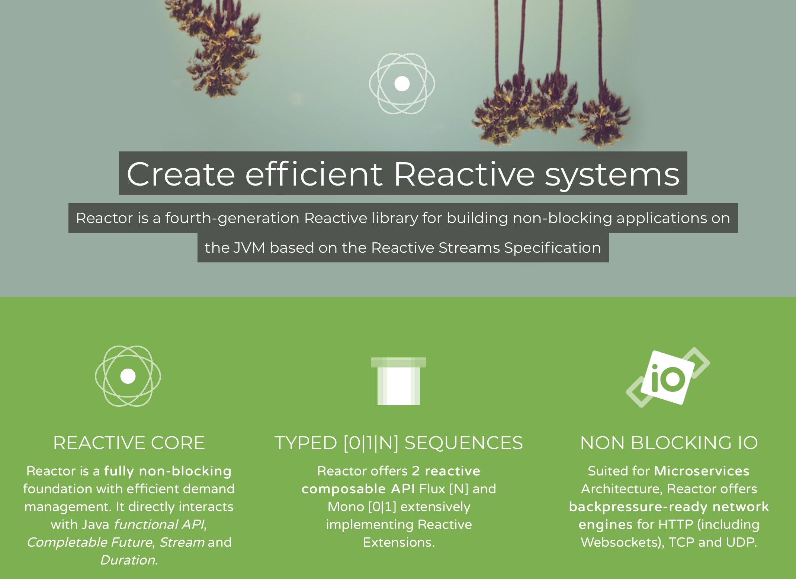
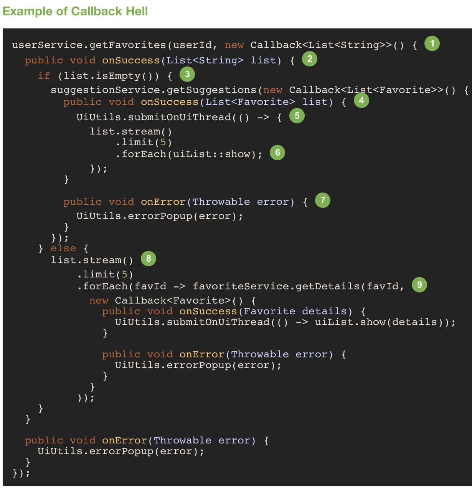

# 数据访问进阶

## Project Reactor 介绍

- 在计算机中，响应式编程或反应式编程（英语：ReactiveProgramming）是⼀种⾯面向数据流和变化传播的编程范式。这意味着可以在编程语⾔中很⽅便地表达静态或动态的数据流，而相关的计算模型会自动将变化的值通过数据流进行传播。
  
  

- 回调式编程与响应式编程的对比

  

  

  

- 一些核⼼的概念

  - Operators - Publisher / Subscriber

    - Nothing Happens Until You subscribe()

    - Flux [ 0..N ] - onNext()、onComplete()、onError()

    - Mono [ 0..1 ] - onNext()、onComplete()、onError()
  
  - Backpressure

    - Subscription()

    - onRequest()、onCancel()、onDispose()

  - 线程调度 Schedulers

    - immediate() / single() / newSingle()
    - elastic() / parallel() / newParallel()

  - 错误处理

    - onError / onErrorReturn / onErrorResume

    - doOnError / doFinally

## 通过 Reactive 的⽅式访问数据-Redis

- Spring Data Redis

  - Lettuce 能够支持 Reactive 方式
  
  - Spring Data Redis 中主要的支持

    - ReactiveRedisConnection

    - ReactiveRedisConnectionFactory

    - ReactiveRedisTemplate

      - opsForXxx()

---
---

## 通过 Reactive 的方式访问数据-MongoDB

- Spring Data MongoDB
  - MongoDB 官方提供了支持 Reactive 的驱动

    - mongodb-driver-reactivestreams

  - Spring Data MongoDB 中主要的⽀支持

    - ReactiveMongoClientFactoryBean

    - ReactiveMongoDatabaseFactory

    - ReactiveMongoTemplate

---
---

## 通过 Reactive 的⽅式访问数据-RDBMS

- Spring Data R2DBC
  - R2DBC （https://spring.io/projects/spring-data-r2dbc）

  - Reactive Relational Database Connectivity
- 支持的数据库

  - Postgres（io.r2dbc:r2dbc-postgresql）

  - H2（io.r2dbc:r2dbc-h2）

  - Microsoft SQL Server（io.r2dbc:r2dbc-mssql）

- 一些主要的类

  - ConnectionFactory

  - DatabaseClient

    - execute().sql(SQL)
    - inTransaction(db -> {})

  - R2dbcExceptionTranslator
    - SqlErrorCodeR2dbcExceptionTranslator

---
---

- R2DBC Repository ⽀持
  
  - 一些主要的类

  - @EnableR2dbcRepositories

  - ReactiveCrudRepository<T, ID>

    - @Table / @Id

    - 其中的⽅法返回都是 Mono 或者 Flux

    - ⾃自定义查询需要自⼰写 @Query

---
---

## 通过 AOP 打印数据访问层摘要

- Spring AOP 的⼀些核心概念

    概念|含义
    ---|---
    Aspect |切面
    Join Point |连接点，Spring AOP里总是代表一次方法执行
    Advice |通知，在连接点执行的动作
    Pointcut |切入点，说明如何匹配连接点
    Introduction |引入，为现有类型声明额外的方法和属性
    Target object |目标对象
    AOP proxy AOP |代理对象，可以是 JDK 动态代理，也可以是 CGLIB 代理
    Weaving| 织入，连接切面与目标对象或类型创建代理的过程

- 常用注解

  - @EnableAspectJAutoProxy

  - @Aspect

  - @Pointcut

  - @Before

  - @After / @AfterReturning / @AfterThrowing

  - @Around

  - @Order

- 如何打印 SQL
  
  - HikariCP

    - P6SQL，https://github.com/p6spy/p6spy
  
  - Alibaba Druid

    - 内置 SQL 输出

    - https://github.com/alibaba/druid/wiki/Druid 中使用log4j2进⾏日志输出

---
---

---

- 本章小结

  - Project Reactor 的基本用法

  - 如何通过 Reactive 的方式访问 NoSQL

  - 如何通过 Reactive 的方式访问 RDBMS

  - Spring AOP 的基本概念

  - 监控 DAO 层的简单方案

- SpringBucks 进度小结

  - 通过 Reactive 的方式来保存数据与操作缓存

---