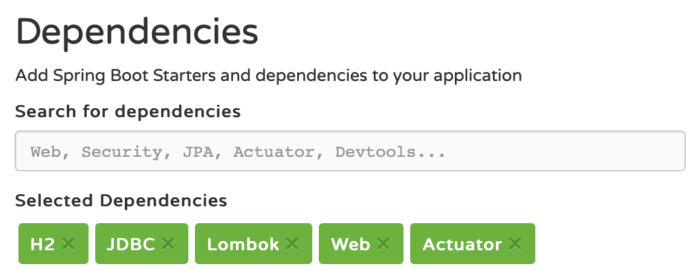

# JDBC必知必会

## 如何配置数据源 

1. Spring Boot 的配置演示 
   - 引⼊对应数据库驱动——H2 
   - 引⼊ JDBC 依赖——spring-boot-starter-jdbc 
   - 获取 DataSource Bean，打印信息 
   - 也可通过 /acturator/beans 查看 Bean 
  
    

    - 运行代码

    ```java
    @SpringBootApplication
    @Slf4j
    public class DatasourceDemoApplication implements CommandLineRunner {

	    @Autowired
	    private DataSource dataSource;

	    @Autowired
	    private JdbcTemplate jdbcTemplate;

	    public static void main(String[] args) {
		    SpringApplication.run(DatasourceDemoApplication.class, args);
	    }

	    @Override
	    public void run(String... args) throws Exception {

		    log.info(dataSource.toString());
		    Connection connection=dataSource.getConnection();
		    log.info(connection.toString());
		    connection.close();

	    }
    }

    ```

   - 启动项目我们可以看到spring boot默认为我们配置好了数据源
   - 运行结果
    

2. 直接配置所需的Bean 

   - 数据源相关 
      - DataSource（根据选择的连接池实现决定） 
   - 事务相关（可选） 
      - PlatformTransactionManager（DataSourceTransactionManager） 
      - TransactionTemplate 
   - 操作相关（可选） 
     - JdbcTemplate 

- 我们通过一个没有springboot的项目来演示jdbc操作
- 

3. Spring Boot 帮我们做了哪些配置 
   - DataSourceAutoConfiguration 
     - 配置 DataSource 
   - DataSourceTransactionManagerAutoConfiguration 
     - 配置 DataSourceTransactionManager 
   - JdbcTemplateAutoConfiguration 
     - 配置 JdbcTemplate 
   - 注意：符合条件时才进⾏配置，如果项目中配置了数据源等信息，springboot不会去再配置这些信息；如果没有相应的配置，sringboot则会去自动配置

4. 数据源相关配置属性 

   - 通⽤ 
     - spring.datasource.url=jdbc:mysql://localhost/test 
     - spring.datasource.username=dbuser 
     - spring.datasource.password=dbpass 
     - spring.datasource.driver-class-name=com.mysql.jdbc.Driver（可选） 
   - 初始化内嵌数据库 
     - spring.datasource.initialization-mode=embedded|always|never 
     - spring.datasource.schema与spring.datasource.data确定初始化SQL⽂件 
     - spring.datasource.platform=hsqldb | h2 | oracle | mysql | postgresql（与前者对应）

- 下面我们通过一个简单的配置实例来演示
- application.properties的配置
  
  ```yml
  management.endpoints.web.exposure.include=*
  spring.output.ansi.enabled=ALWAYS

  spring.datasource.url=jdbc:h2:mem:testdb
  spring.datasource.username=sa
  spring.datasource.password=
  spring.datasource.hikari.maximumPoolSize=5
  spring.datasource.hikari.minimumIdle=5
  spring.datasource.hikari.idleTimeout=600000
  spring.datasource.hikari.connectionTimeout=30000
  spring.datasource.hikari.maxLifetime=1800000
  ```

- 实例代码
  ```java
    @SpringBootApplication
    @Slf4j
    public class DatasourceDemoApplication implements CommandLineRunner {

	    @Autowired
	    private DataSource dataSource;

	    @Autowired
	    private JdbcTemplate jdbcTemplate;

	    public static void main(String[] args) {
		    SpringApplication.run(DatasourceDemoApplication.class, args);
	    }

	    @Override
	    public void run(String... args) throws Exception {

		    showConnection();
		    showData();

	    }

	    public void showConnection() throws SQLException {
		    log.info(dataSource.toString());
		    Connection connection=dataSource.getConnection();
		    log.info(connection.toString());
		    connection.close();
	    }


	    public void showData(){

		    jdbcTemplate.queryForList("SELECT * FROM FOO")
				    .forEach(row->log.info(row.toString()));
	    }
    }
  ```
- 运行结果
  
  
## 多数据源的配置注意事项