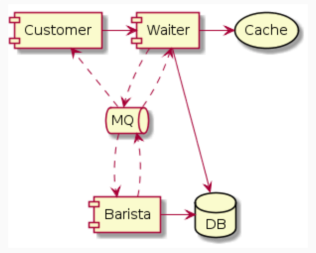

# O/R Mapping 实践

## 认识 Spring Data JPA

- 对象与关系的范式不匹配,由此诞生了jpa的开发需求

    ||Object|RDBMS
    |---|---|---
    粒度 |类 |表
    继承 |有 |没有
    唯⼀性 |a == b  |主键
    关联 |引⽤ |外键
    数据访问 |逐级访问（通过对象属性访问） |SQL 数量要少(通过join链接访问)

- Hibernate

  - 一款开源的对象关系映射（Object / Relational Mapping）框架
  - 将开发者从 95% 的常⻅数据持久化⼯作中解放出来
  - 屏蔽了底层数据库的各种细节

- Hibernate 发展历程
  - 2001年，Gavin King 发布第⼀个版本 
  - 2003年，Hibernate 开发团队加⼊ JBoss 
  - 2006年，Hibernate 3.2 成为 JPA 实现 

- Java Persistence API 即JPA

  - JPA 为对象关系映射提供了⼀种基于 POJO 的持久化模型 
    - 简化数据持久化代码的开发⼯作 
    - 为 Java 社区屏蔽不同持久化 API 的差异 
  - 2006 年，JPA 1.0 作为 JSR 220 的⼀部分正式发布 

- Spring Data 
  - 在保留底层存储特性的同时，提供相对⼀致的、基于 Spring 的编程模型 主要模块 
    - Spring Data Commons 
    - Spring Data JDBC 
    - Spring Data JPA 
    - Spring Data Redis 
    - …… 

    
    

## 定义 JPA 实体对象 

- 常⽤ JPA 注解 

  - 实体 
    - @Entity、@MappedSuperclass 
    - @Table(name) 
  - 主键 
    - @Id 
    - @GeneratedValue(strategy, generator) 
    - @SequenceGenerator(name, sequenceName) 

  - 映射 
    - @Column(name, nullable, length, insertable, updatable) 
    - @JoinTable(name)、@JoinColumn(name) 
  - 关系 
    - @OneToOne、@OneToMany、@ManyToOne、@ManyToMany 
    - @OrderBy 

- Project Lombok 
  - Project Lombok 能够⾃动嵌⼊ IDE 和构建⼯具，提升开发效率 
  - 常⽤功能 
    - @Getter / @Setter 
    - @ToString 
    - @NoArgsConstructor / @RequiredArgsConstructor / @AllArgsConstructor 
    - @Data 
    - @Builder 
    - @Slf4j / @CommonsLog / @Log4j2 

---

## 线上咖啡馆实战项⽬-SpringBucks 

- 项⽬⽬标 
  - 通过⼀个完整的例⼦演示 Spring 全家桶各主要成员的⽤法 
  
  
  
  
- 项⽬中的对象实体 
  - 实体 
    - 咖啡、订单、顾客、服务员、咖啡师 
  - 实体关系

    

- 状态图

    

- 实体定义

---