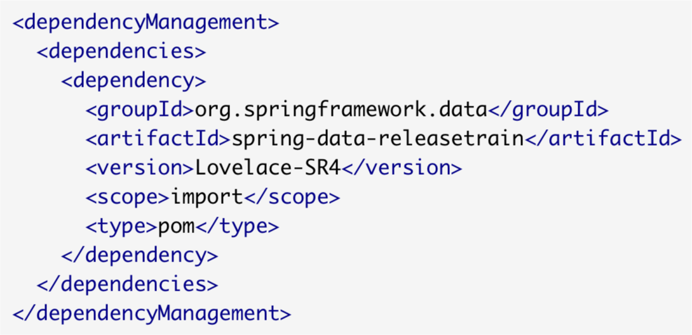
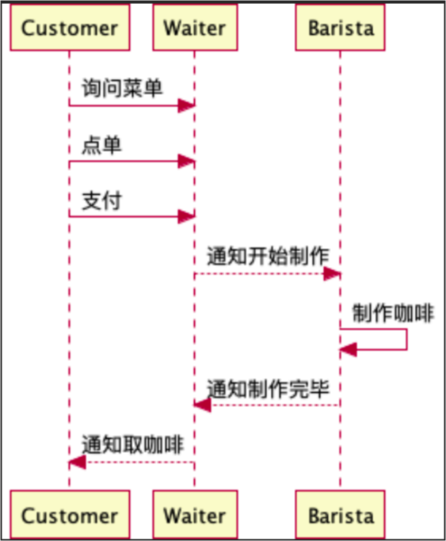
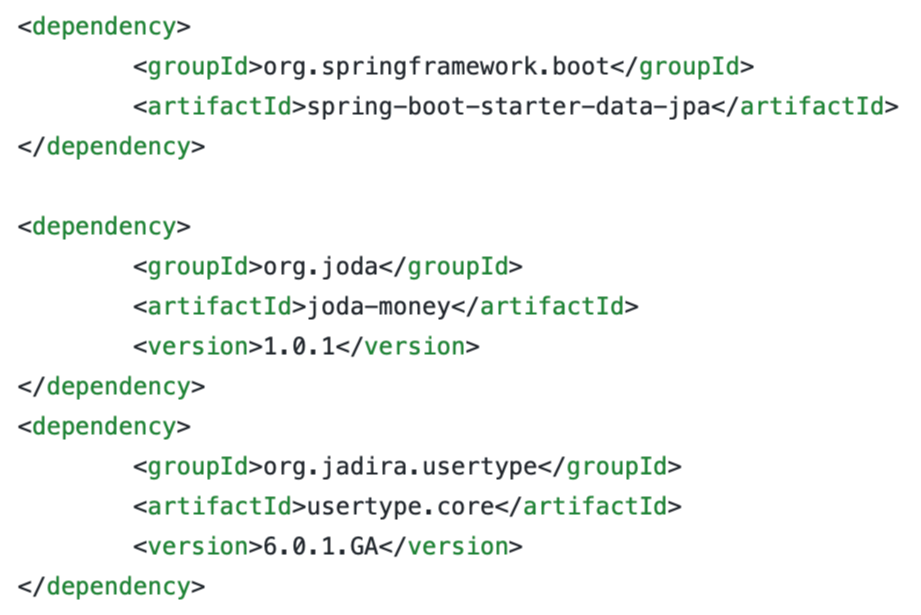

# O/R Mapping 实践

[TOC]

------


## 认识 Spring Data JPA

- 对象与关系的范式不匹配,由此诞生了jpa的开发需求

    |          | Object                       | RDBMS                          |
    | -------- | ---------------------------- | ------------------------------ |
    | 粒度     | 类                           | 表                             |
    | 继承     | 有                           | 没有                           |
    | 唯⼀性   | a == b                       | 主键                           |
    | 关联     | 引⽤                         | 外键                           |
    | 数据访问 | 逐级访问（通过对象属性访问） | SQL 数量要少(通过join链接访问) |


- Hibernate

  - 一款开源的对象关系映射（Object / Relational Mapping）框架
  - 将开发者从 95% 的常⻅数据持久化⼯作中解放出来
  - 屏蔽了底层数据库的各种细节

- Hibernate 发展历程
  - 2001年，Gavin King 发布第⼀个版本 
  - 2003年，Hibernate 开发团队加⼊ JBoss 
  - 2006年，Hibernate 3.2 成为 JPA 实现 

- Java Persistence API 即JPA

  - JPA 为对象关系映射提供了⼀种基于 POJO 的持久化模型 
    - 简化数据持久化代码的开发⼯作 
    - 为 Java 社区屏蔽不同持久化 API 的差异 
  - 2006 年，JPA 1.0 作为 JSR 220 的⼀部分正式发布 

- Spring Data 
  - 在保留底层存储特性的同时，提供相对⼀致的、基于 Spring 的编程模型 主要模块 
    - Spring Data Commons 
    - Spring Data JDBC 
    - Spring Data JPA 
    - Spring Data Redis 
    - …… 

    
    

## 定义 JPA 实体对象 

- 常⽤ JPA 注解 

  - 实体 
    - @Entity(标注实体)、@MappedSuperclass(实体共同的父类使用此注解标注) 
    - @Table(name) 
  - 主键 
    - @Id (标识ID)
    - @GeneratedValue(strategy, generator) (标识生成主键，指明生成策略及生成器)
    - @SequenceGenerator(name, sequenceName) (标识序列化生成器)

    

  - 映射 
  
    - @Column(name, nullable, length, insertable, updatable) 
    - @JoinTable(name)、@JoinColumn(name) (关联join时使用)
  
  - 关系 
    - @OneToOne、@OneToMany、@ManyToOne、@ManyToMany 
    - @OrderBy 


- Project Lombok 
  
  - Project Lombok 能够⾃动嵌⼊ IDE 和构建⼯具，提升开发效率 
  - 常⽤功能 
    - @Getter / @Setter 
    - @ToString 
    - @NoArgsConstructor / @RequiredArgsConstructor / @AllArgsConstructor 
    - @Data 
    - @Builder 
    - @Slf4j / @CommonsLog / @Log4j2 


## 线上咖啡馆实战项⽬-SpringBucks 

- 项⽬⽬标 
  - 通过⼀个完整的例⼦演示 Spring 全家桶各主要成员的⽤法 
  
  
  
  
- 项⽬中的对象实体 
  - 实体 
    
    - 咖啡、订单、顾客、服务员、咖啡师 
- 实体关系
  
  
  
- 状态图

    

- 实体定义

  
  

  
---

- 简单的jpa实例-jpa_demo

  - application.yml

  ```yml
  spring.jpa.hibernate.ddl-auto=create-drop
  spring.jpa.properties.hibernate.show_sql=true
  spring.jpa.properties.hibernate.format_sql=true
  ```

  - pom.xml

  ```xml
  <dependencies>
          <dependency>
              <groupId>org.springframework.boot</groupId>
              <artifactId>spring-boot-starter-actuator</artifactId>
          </dependency>
          <dependency>
              <groupId>org.springframework.boot</groupId>
              <artifactId>spring-boot-starter-data-jdbc</artifactId>
          </dependency>
          <dependency>
              <groupId>org.springframework.boot</groupId>
              <artifactId>spring-boot-starter-data-jpa</artifactId>
          </dependency>
          <dependency>
              <groupId>org.springframework.boot</groupId>
              <artifactId>spring-boot-starter-web</artifactId>
          </dependency>

          <dependency>
              <groupId>org.joda</groupId>
              <artifactId>joda-money</artifactId>
              <version>1.0.1</version>
          </dependency>
          <dependency>
              <groupId>org.jadira.usertype</groupId>
              <artifactId>usertype.core</artifactId>
              <version>6.0.1.GA</version>
          </dependency>

          <dependency>
              <groupId>com.h2database</groupId>
              <artifactId>h2</artifactId>
              <scope>runtime</scope>
          </dependency>
          <dependency>
              <groupId>org.projectlombok</groupId>
              <artifactId>lombok</artifactId>
              <optional>true</optional>
          </dependency>
          <dependency>
              <groupId>org.springframework.boot</groupId>
              <artifactId>spring-boot-starter-test</artifactId>
              <scope>test</scope>
          </dependency>
      </dependencies>
  ```

  - Coffee.java

  ```java
  @Entity
  @Table(name = "T_MENU")
  @Data
  @AllArgsConstructor
  @NoArgsConstructor
  @Builder
  public class Coffee implements Serializable {

      @Id
      @GeneratedValue
      private Long id;
    
      private String name;

      @Column
      @Type(type = "org.jadira.usertype.moneyandcurrency.joda.PersistentMoneyAmount",
              parameters = {@org.hibernate.annotations.Parameter(name = "currencyCode", value = "CNY")})
      private Money price;
    
      @Column(updatable = false)
      @CreationTimestamp
      private Date createTime;
    
      @UpdateTimestamp
      private Date updateTime;
  }

  ```

  - CoffeeOrder.java

  ```java
  @Entity
  @Data
  @AllArgsConstructor
  @NoArgsConstructor
  @Builder
  @Table(name = "T_ORDER")
  public class CoffeeOrder implements Serializable {

      @Id
      @GeneratedValue
      private Long id;

      private String customer;

      @ManyToMany
      @JoinTable(name = "T_ORDER_COFFEE")
      private List<Coffee> items;

      @Column(nullable = false)
      private Integer state;

      @Column(updatable = false)
      @CreationTimestamp
      private Date createTime;

      @UpdateTimestamp
      private Date updateTime;

  }
  ```

  - CoffeeRepository.java

  ```java
  public interface CoffeeOrderRepository extends CrudRepository<CoffeeOrder,Long> {
  }
  ```

  - CoffeeOrderRepository.java

  ```java
  public interface CoffeeRepository extends CrudRepository<Coffee,Long> {
  }
  ```

  - JpaDemoApplication.java

  ```java
  @Slf4j
  @EnableJpaRepositories
  @SpringBootApplication
  public class JpaDemoApplication implements ApplicationRunner {

      @Autowired
      private CoffeeRepository coffeeRepository;

      @Autowired
      private CoffeeOrderRepository coffeeOrderRepository;

      public static void main(String[] args) {
          SpringApplication.run(JpaDemoApplication.class, args);
      }

      @Override
      public void run(ApplicationArguments args) throws Exception {

          //initOrders();
      }

      public void initOrders() {

          Coffee espresso = Coffee.builder().name("espresso")
                  .price(Money.of(CurrencyUnit.of("CNY"), 20.0)).build();

          coffeeRepository.save(espresso);
          log.info("Coffee: {}", espresso);

          Coffee latte = Coffee.builder().name("latte")
                  .price(Money.of(CurrencyUnit.of("CNY"), 30.0))
                  .build();

          coffeeRepository.save(latte);

          log.info("Coffee: {}", latte);

          CoffeeOrder li_lei = CoffeeOrder.builder().customer("Li Lei")
                  .items(Collections.singletonList(espresso))
                  .state(0)
                  .build();

          coffeeOrderRepository.save(li_lei);

          log.info("Coffee Order : {}", li_lei);

          li_lei = CoffeeOrder.builder().customer("Li Lei")
                  .items(Arrays.asList(espresso, latte))
                  .state(0)
                  .build();
    
          coffeeOrderRepository.save(li_lei);
    
          log.info("Coffee Order :{}", li_lei);
    
      }
  }
  ```

- 运行结果

  ```yml
  2019-12-19 22:49:48.344  INFO 1233 --- [           main] org.hibernate.dialect.Dialect            : HHH000400: Using dialect: org.hibernate.dialect.H2Dialect
  Hibernate: 
      
      drop table t_menu if exists
  Hibernate: 
      
      drop table t_order if exists
  Hibernate: 
      
      drop table t_order_coffee if exists
  Hibernate: 
      
      drop sequence if exists hibernate_sequence
  Hibernate: create sequence hibernate_sequence start with 1 increment by 1
  Hibernate: 
      
      create table t_menu (
        id bigint not null,
          create_time timestamp,
          name varchar(255),
          price decimal(19,2),
          update_time timestamp,
          primary key (id)
      )
  Hibernate: 
      
      create table t_order (
        id bigint not null,
          create_time timestamp,
          customer varchar(255),
          state integer not null,
          update_time timestamp,
          primary key (id)
      )
  Hibernate: 
      
      create table t_order_coffee (
        coffee_order_id bigint not null,
          items_id bigint not null
      )
  Hibernate: 
      
      alter table t_order_coffee 
        add constraint FKj2swxd3y69u2tfvalju7sr07q 
        foreign key (items_id) 
        references t_menu
  Hibernate: 
      
      alter table t_order_coffee 
        add constraint FK33ucji9dx64fyog6g17blpx9v 
        foreign key (coffee_order_id) 
        references t_order
  2019-12-19 22:49:50.424  INFO 1233 --- [           main] o.h.e.t.j.p.i.JtaPlatformInitiator       : HHH000490: Using JtaPlatform implementation: [org.hibernate.engine.transaction.jta.platform.internal.NoJtaPlatform]
  ```

---

---

- 复杂的jpa实例-jpa_complex_demo

  - application.yml

  ```yml
  spring.jpa.hibernate.ddl-auto=create-drop
  spring.jpa.properties.hibernate.show_sql=true
  spring.jpa.properties.hibernate.format_sql=true
  ```

  - pom.xml

  ```xml
  <dependencies>
          <dependency>
              <groupId>org.springframework.boot</groupId>
              <artifactId>spring-boot-starter-actuator</artifactId>
          </dependency>
          <dependency>
              <groupId>org.springframework.boot</groupId>
              <artifactId>spring-boot-starter-data-jdbc</artifactId>
          </dependency>
          <dependency>
              <groupId>org.springframework.boot</groupId>
              <artifactId>spring-boot-starter-data-jpa</artifactId>
          </dependency>
          <dependency>
              <groupId>org.springframework.boot</groupId>
              <artifactId>spring-boot-starter-web</artifactId>
          </dependency>

          <dependency>
              <groupId>org.joda</groupId>
              <artifactId>joda-money</artifactId>
              <version>1.0.1</version>
          </dependency>
          <dependency>
              <groupId>org.jadira.usertype</groupId>
              <artifactId>usertype.core</artifactId>
              <version>6.0.1.GA</version>
          </dependency>
          <dependency>
              <groupId>com.h2database</groupId>
              <artifactId>h2</artifactId>
              <scope>runtime</scope>
          </dependency>
          <dependency>
              <groupId>org.projectlombok</groupId>
              <artifactId>lombok</artifactId>
              <optional>true</optional>
          </dependency>
          <dependency>
              <groupId>org.springframework.boot</groupId>
              <artifactId>spring-boot-starter-test</artifactId>
              <scope>test</scope>

          </dependency>
      </dependencies>
  ```

  - BaseEntity.java

  ```java
  @Entity
  @Data
  @AllArgsConstructor
  @NoArgsConstructor
  @Builder
  @MappedSuperclass
  public class BaseEntity implements Serializable {

      @Id
      @GeneratedValue
      private Long id;

      @Column(updatable = false)
      @CreationTimestamp
      private Date createTime;

      @UpdateTimestamp
      private Date updateTime;
  }
  ```

  - Coffee.java

  ```java
  @Entity
  @Table(name = "T_MENU")
  @Builder
  @Data
  @ToString(callSuper = true)
  @AllArgsConstructor
  @NoArgsConstructor
  public class Coffee extends BaseEntity implements Serializable {

      private String name;

      @Type(type = "org.jadira.usertype.moneyandcurrency.joda.PersistentMoneyAmount",
              parameters = {@org.hibernate.annotations.Parameter(name = "currencyCode", value = "CNY")})
      private Money price;
  }
  ```

  - CoffeeOrder.java

  ```java
  @Data
  @AllArgsConstructor
  @NoArgsConstructor
  @Builder
  @Entity
  @ToString(callSuper = true)
  @Table(name = "T_ORDER")
  public class CoffeeOrder extends BaseEntity implements Serializable {

      private String customer;
      @ManyToMany
      @JoinTable(name = "T_ORDER_COFFEE")
      @OrderBy("id")
      private List<Coffee> items;
    
      @Enumerated
      @Column(nullable = false)
      private OrderState state;
  }
  ```

  - OrderState.java

  ```java
  public enum OrderState {
      INIT, PAID, BREWING, BREWED, TAKEN, CANCELLED
  }
  ```

  - BaseRespository.java

  ```java
  public interface BaseRepository<T,Long> extends PagingAndSortingRepository<T,Long> {

      List<T> findTop3ByOrderByUpdateTimeDescIdAsc();
  }
  ```

- CoffeeRepository.java

  ```java
  public interface CoffeeRepository extends BaseRepository<Coffee,Long> {
  }
  ```

- CoffeeOrderRepository.java

  ```java
  public interface CoffeeOrderRepository extends BaseRepository<CoffeeOrder,Long> {

      List<CoffeeOrder> findByCustomerOrderById(String customer);
      List<CoffeeOrder> findByItems_Name(String name);
  }
  ```

- JpaComplexApplication.java

  ```java
  @EnableJpaRepositories
  @SpringBootApplication
  @EnableTransactionManagement
  @Slf4j
  public class JpaComplexDemoApplication implements ApplicationRunner {

      @Autowired
      private CoffeeOrderRepository coffeeOrderRepository;

      @Autowired
      private CoffeeRepository coffeeRepository;

      @Autowired
      private BaseRepository baseRepository;

      public static void main(String[] args) {
          SpringApplication.run(JpaComplexDemoApplication.class, args);
      }

      @Override
      @Transactional
      public void run(ApplicationArguments args) throws Exception {

          //initOrders();
          //findOrders();
      }

      private void initOrders() {
          Coffee latte = Coffee.builder().name("latte")
                  .price(Money.of(CurrencyUnit.of("CNY"), 30.0))
                  .build();
          coffeeRepository.save(latte);
          log.info("Coffee: {}", latte);

          Coffee espresso = Coffee.builder().name("espresso")
                  .price(Money.of(CurrencyUnit.of("CNY"), 20.0))
                  .build();
          coffeeRepository.save(espresso);
          log.info("Coffee: {}", espresso);

          CoffeeOrder order = CoffeeOrder.builder()
                  .customer("Li Lei")
                  .items(Collections.singletonList(espresso))
                  .state(OrderState.INIT)
                  .build();
          coffeeOrderRepository.save(order);
          log.info("Order: {}", order);

          order = CoffeeOrder.builder()
                  .customer("Li Lei")
                  .items(Arrays.asList(espresso, latte))
                  .state(OrderState.INIT)
                  .build();
          coffeeOrderRepository.save(order);
          log.info("Order: {}", order);
      }

      private void findOrders() {
          coffeeRepository
                  .findAll(Sort.by(Sort.Direction.DESC, "id"))
                  .forEach(c -> log.info("Loading {}", c));
    
          List<CoffeeOrder> list = coffeeOrderRepository.findTop3ByOrderByUpdateTimeDescIdAsc();
          log.info("findTop3ByOrderByUpdateTimeDescIdAsc: {}", getJoinedOrderId(list));
    
          list = coffeeOrderRepository.findByCustomerOrderById("Li Lei");
          log.info("findByCustomerOrderById: {}", getJoinedOrderId(list));
    
          // 不开启事务会因为没Session而报LazyInitializationException
          list.forEach(o -> {
              log.info("Order {}", o.getId());
              o.getItems().forEach(i -> log.info("  Item {}", i));
          });
    
          list = coffeeOrderRepository.findByItems_Name("latte");
          log.info("findByItems_Name: {}", getJoinedOrderId(list));
      }
    
      private String getJoinedOrderId(List<CoffeeOrder> list) {
          return list.stream().map(o -> o.getId().toString())
                  .collect(Collectors.joining(","));
      }
  }
  ```

- 运行结果

```yml
2019-12-19 23:13:12.288  INFO 1477 --- [           main] org.hibernate.dialect.Dialect            : HHH000400: Using dialect: org.hibernate.dialect.H2Dialect
Hibernate: 
    
    drop table t_menu if exists
Hibernate: 
    
    drop table t_order if exists
Hibernate: 
    
    drop table t_order_coffee if exists
Hibernate: 
    
    drop sequence if exists hibernate_sequence
Hibernate: create sequence hibernate_sequence start with 1 increment by 1
Hibernate: 
    
    create table t_menu (
       id bigint not null,
        create_time timestamp,
        update_time timestamp,
        name varchar(255),
        price decimal(19,2),
        primary key (id)
    )
Hibernate: 
    
    create table t_order (
       id bigint not null,
        create_time timestamp,
        update_time timestamp,
        customer varchar(255),
        state integer not null,
        primary key (id)
    )
Hibernate: 
    
    create table t_order_coffee (
       coffee_order_id bigint not null,
        items_id bigint not null
    )
Hibernate: 
    
    alter table t_order_coffee 
       add constraint FKj2swxd3y69u2tfvalju7sr07q 
       foreign key (items_id) 
       references t_menu
Hibernate: 
    
    alter table t_order_coffee 
       add constraint FK33ucji9dx64fyog6g17blpx9v 
       foreign key (coffee_order_id) 
       references t_order
2019-12-19 23:13:14.386  INFO 1477 --- [           main] o.h.e.t.j.p.i.JtaPlatformInitiator       : HHH000490: Using JtaPlatform implementation: [org.hibernate.engine.transaction.jta.platform.internal.NoJtaPlatform]
  
```

---

## 通过 Spring Data JPA 操作数据库

- Repository
  
  - @EnableJpaRepositories 注解启用jpa Repository
  - Repository<T, ID> 接⼝的实现有哪些
    - CrudRepository<T, ID>
    - PagingAndSortingRepository<T, ID>
    - JpaRepository<T, ID>

- 如何定义查询
  
  - 根据⽅法名定义查询
    - find…By… / read…By… / query…By… / get…By…
    - count…By…
    - …OrderBy…[Asc / Desc]
    - And / Or / IgnoreCase
    - Top / First / Distinct

- 分⻚查询的实现
  
  - PagingAndSortingRepository<T, ID>
  - Pageable / Sort
  - Slice<T> / Page<T>

- 保存实体
  
---

```java
            Coffee latte = Coffee.builder().name("latte")
                    .price(Money.of(CurrencyUnit.of("CNY"), 30.0))
                    .build();
            coffeeRepository.save(latte);
            log.info("Coffee: {}", latte);

            Coffee espresso = Coffee.builder().name("espresso")
                    .price(Money.of(CurrencyUnit.of("CNY"), 20.0))
                    .build();
            coffeeRepository.save(espresso);
            log.info("Coffee: {}", espresso);
  ```

---

---

    ```java
    CoffeeOrder order = CoffeeOrder.builder()
                    .customer("Li Lei")
                    .items(Collections.singletonList(espresso))
                    .state(OrderState.INIT)
                    .build();
            orderRepository.save(order);
            log.info("Order: {}", order);
    
            order = CoffeeOrder.builder()
                    .customer("Li Lei")
                    .items(Arrays.asList(espresso, latte))
                    .state(OrderState.INIT)
                    .build();
            orderRepository.save(order);
            log.info("Order: {}", order);
  ```

---

- 查询实体

---

    ```java
    offeeRepository
                    .findAll(Sort.by(Sort.Direction.DESC, "id"))
                    .forEach(c -> log.info("Loading {}", c));
    
            List<CoffeeOrder> list = orderRepository.findTop3ByOrderByUpdateTimeDescIdAsc();
            log.info("findTop3ByOrderByUpdateTimeDescIdAsc: {}", getJoinedOrderId(list));
    
            list = orderRepository.findByCustomerOrderById("Li Lei");
            log.info("findByCustomerOrderById: {}", getJoinedOrderId(list));
    ```

---

---

    ```java
    public interface CoffeeOrderRepository extends BaseRepository<CoffeeOrder, Long> {
        List<CoffeeOrder> findByCustomerOrderById(String customer);
        List<CoffeeOrder> findByItems_Name(String name);
    }
    ```

---


## Repository 是怎么从接⼝变成 Bean 的

- Repository Bean 是如何创建的

  - JpaRepositoriesRegistrar
    - 激活了 @EnableJpaRepositories
    - 返回了 JpaRepositoryConfigExtension
  - RepositoryBeanDefinitionRegistrarSupport.registerBeanDefinitions 
    - 注册 Repository Bean（类型是 JpaRepositoryFactoryBean ）
  - RepositoryConfigurationExtensionSupport.getRepositoryConfigurations 
    - 取得 Repository 配置
  - JpaRepositoryFactory.getTargetRepository 
    - 创建了 Repository

- 接⼝中的⽅法是如何被解释的

  - RepositoryFactorySupport.getRepository 添加了Advice 增强
    - DefaultMethodInvokingMethodInterceptor
    - QueryExecutorMethodInterceptor
  - AbstractJpaQuery.execute 执⾏具体的查询
    - 语法解析在 Part 中

## 通过 MyBatis 操作数据库

- 认识 MyBatis

  - MyBatis（https://github.com/mybatis/mybatis-3）
    - ⼀款优秀的持久层框架
    - ⽀持定制化 SQL、存储过程和⾼级映射
  - 在 Spring 中使⽤ MyBatis 
    - MyBatis Spring Adapter（https://github.com/mybatis/spring）
    - MyBatis Spring-Boot-Starter（https://github.com/mybatis/spring-boot-starter）

  - 简单配置

    - mybatis.mapper-locations = classpath*:mapper/**/*.xml
    - mybatis.type-aliases-package = 类型别名的包名
    - mybatis.type-handlers-package = TypeHandler扫描包名
    - mybatis.configuration.map-underscore-to-camel-case = true

  - Mapper 的定义与扫描
    - @MapperScan 配置扫描位置
    - @Mapper 定义接⼝
    - 映射的定义—— XML 与注解

---

    ```java
    
    @Mapper
    public interface CoffeeMapper {


        @Insert("insert into t_coffee (name, price, create_time, update_time)"
                + "values (#{name}, #{price}, now(), now())")
        @Options(useGeneratedKeys = true,keyProperty = "id")
        int save(Coffee coffee);
    
        @Select("select * from t_coffee where id = #{id}")
        @Results({
                @Result(id = true, column = "id", property = "id"),
                @Result(column = "create_time", property = "createTime"),
                // map-underscore-to-camel-case = true 可以实现一样的效果
                // @Result(column = "update_time", property = "updateTime"),
        })
        Coffee findById(@Param("id") Long id);
    }
    
    ```

---

## 让 MyBatis 更好⽤的那些⼯具-MyBatis Generator

- 认识 MyBatis Generator
  - MyBatis Generator（http://www.mybatis.org/generator/）
    - MyBatis 代码⽣成器
    - 根据数据库表⽣成相关代码
      - POJO
      - Mapper 接⼝
      - SQL Map XML

- 运⾏ MyBatis Generator
  
  - 命令⾏
    - java -jar mybatis-generator-core-x.x.x.jar -configfile generatorConfig.xml 
  - Maven Plugin（mybatis-generator-maven-plugin）
    - mvn mybatis-generator:generate 
    - ${basedir}/src/main/resources/generatorConfig.xml
  - Eclipse Plugin 
  - Java 程序
  - Ant Task

- 配置 MyBatis Generator
  - generatorConfiguration 
  - context 
    - jdbcConnection
    - javaModelGenerator
    - sqlMapGenerator
    - javaClientGenerator （ANNOTATEDMAPPER(基于注解的mapper，适用于简单逻辑) / XMLMAPPER(基于XML的mapper，适用于复杂逻辑需要微调的) / MIXEDMAPPER(混合型的mapper，对于简单的接口实现使用注解完成，对于复杂的接口实现则通过XML的配置实现)）
    - table

- ⽣成时可以使⽤的插件
  - 内置插件都在 org.mybatis.generator.plugins 包中
    - FluentBuilderMethodsPlugin
    - ToStringPlugin
    - SerializablePlugin
    - RowBoundsPlugin
    - ……

- 使⽤⽣成的对象
  - 简单操作，直接使⽤⽣成的 xxxMapper 的⽅法
  - 复杂查询，使⽤⽣成的 xxxExample 对象

---

- 实例代码
  
```java
Coffee espresso = new Coffee()
                .withName("espresso")
                .withPrice(Money.of(CurrencyUnit.of("CNY"), 20.0))
                .withCreateTime(new Date())
                .withUpdateTime(new Date());
        coffeeMapper.insert(espresso);

        Coffee latte = new Coffee()
                .withName("latte")
                .withPrice(Money.of(CurrencyUnit.of("CNY"), 30.0))
                .withCreateTime(new Date())
                .withUpdateTime(new Date());
        coffeeMapper.insert(latte);

        Coffee s = coffeeMapper.selectByPrimaryKey(1L);
        log.info("Coffee {}", s);

        CoffeeExample example = new CoffeeExample();
        example.createCriteria().andNameEqualTo("latte");
        List<Coffee> list = coffeeMapper.selectByExample(example);
        list.forEach(e -> log.info("selectByExample: {}", e));
```

- 运行结果

```yml
2020-01-05 22:26:06.932  INFO 1798 --- [           main] com.zaxxer.hikari.HikariDataSource       : HikariPool-1 - Starting...
2020-01-05 22:26:07.093  INFO 1798 --- [           main] com.zaxxer.hikari.HikariDataSource       : HikariPool-1 - Start completed.
2020-01-05 22:26:07.900  INFO 1798 --- [           main] c.s.m.MybatisGeneratorDemoApplication    : Started MybatisGeneratorDemoApplication in 2.985 seconds (JVM running for 4.533)
2020-01-05 22:26:07.999  INFO 1798 --- [           main] c.s.m.MybatisGeneratorDemoApplication    : Coffee Coffee [Hash = 365201320, id=1, name=espresso, price=CNY 20.00, createTime=Sun Jan 05 22:26:07 CST 2020, updateTime=Sun Jan 05 22:26:07 CST 2020]
2020-01-05 22:26:08.030  INFO 1798 --- [           main] c.s.m.MybatisGeneratorDemoApplication    : selectByExample: Coffee [Hash = 793483510, id=2, name=latte, price=CNY 30.00, createTime=Sun Jan 05 22:26:07 CST 2020, updateTime=Sun Jan 05 22:26:07 CST 2020]
2020-01-05 22:26:08.035  INFO 1798 --- [extShutdownHook] com.zaxxer.hikari.HikariDataSource       : HikariPool-1 - Shutdown initiated...
2020-01-05 22:26:08.038  INFO 1798 --- [extShutdownHook] com.zaxxer.hikari.HikariDataSource       : HikariPool-1 - Shutdown completed.
```

---

## 让 MyBatis 更好⽤的那些⼯具- MyBatis PageHelper

- 认识 MyBatis PageHelper
  
  - MyBatis PageHepler（https://pagehelper.github.io）
    - ⽀持多种数据库
    - ⽀持多种分⻚⽅式
    - SpringBoot ⽀持（https://github.com/pagehelper/pagehelper-spring-boot ）
    - pagehelper-spring-boot-starter

- 实例代码
  
```java
        coffeeMapper.findAllWithRowBounds(new RowBounds(1, 3))
                .forEach(c -> log.info("Page(1) Coffee {}", c));
        coffeeMapper.findAllWithRowBounds(new RowBounds(2, 3))
                .forEach(c -> log.info("Page(2) Coffee {}", c));

        log.info("===================");

        coffeeMapper.findAllWithRowBounds(new RowBounds(1, 0))
                .forEach(c -> log.info("Page(1) Coffee {}", c));

        log.info("===================");

        coffeeMapper.findAllWithParam(1, 3)
                .forEach(c -> log.info("Page(1) Coffee {}", c));
        List<Coffee> list = coffeeMapper.findAllWithParam(2, 3);
        PageInfo page = new PageInfo(list);
        log.info("PageInfo: {}", page);
```

- 运行结果

```yml
2020-01-05 22:45:29.080  INFO 1925 --- [           main] com.zaxxer.hikari.HikariDataSource       : HikariPool-1 - Starting...
2020-01-05 22:45:29.242  INFO 1925 --- [           main] com.zaxxer.hikari.HikariDataSource       : HikariPool-1 - Start completed.
2020-01-05 22:45:29.940  INFO 1925 --- [           main] c.s.m.MybatisPagehelperDemoApplication   : Started MybatisPagehelperDemoApplication in 3.371 seconds (JVM running for 4.737)
2020-01-05 22:45:30.098  INFO 1925 --- [           main] c.s.m.MybatisPagehelperDemoApplication   : Page(1) Coffee Coffee(id=1, name=espresso, price=CNY 20.00, createTime=Sun Jan 05 22:45:29 CST 2020, updateTime=Sun Jan 05 22:45:29 CST 2020)
2020-01-05 22:45:30.098  INFO 1925 --- [           main] c.s.m.MybatisPagehelperDemoApplication   : Page(1) Coffee Coffee(id=2, name=latte, price=CNY 25.00, createTime=Sun Jan 05 22:45:29 CST 2020, updateTime=Sun Jan 05 22:45:29 CST 2020)
2020-01-05 22:45:30.098  INFO 1925 --- [           main] c.s.m.MybatisPagehelperDemoApplication   : Page(1) Coffee Coffee(id=3, name=capuccino, price=CNY 25.00, createTime=Sun Jan 05 22:45:29 CST 2020, updateTime=Sun Jan 05 22:45:29 CST 2020)
2020-01-05 22:45:30.101  INFO 1925 --- [           main] c.s.m.MybatisPagehelperDemoApplication   : Page(2) Coffee Coffee(id=4, name=mocha, price=CNY 30.00, createTime=Sun Jan 05 22:45:29 CST 2020, updateTime=Sun Jan 05 22:45:29 CST 2020)
2020-01-05 22:45:30.101  INFO 1925 --- [           main] c.s.m.MybatisPagehelperDemoApplication   : Page(2) Coffee Coffee(id=5, name=macchiato, price=CNY 30.00, createTime=Sun Jan 05 22:45:29 CST 2020, updateTime=Sun Jan 05 22:45:29 CST 2020)
2020-01-05 22:45:30.101  INFO 1925 --- [           main] c.s.m.MybatisPagehelperDemoApplication   : ===================
2020-01-05 22:45:30.104  INFO 1925 --- [           main] c.s.m.MybatisPagehelperDemoApplication   : Page(1) Coffee Coffee(id=1, name=espresso, price=CNY 20.00, createTime=Sun Jan 05 22:45:29 CST 2020, updateTime=Sun Jan 05 22:45:29 CST 2020)
2020-01-05 22:45:30.104  INFO 1925 --- [           main] c.s.m.MybatisPagehelperDemoApplication   : Page(1) Coffee Coffee(id=2, name=latte, price=CNY 25.00, createTime=Sun Jan 05 22:45:29 CST 2020, updateTime=Sun Jan 05 22:45:29 CST 2020)
2020-01-05 22:45:30.104  INFO 1925 --- [           main] c.s.m.MybatisPagehelperDemoApplication   : Page(1) Coffee Coffee(id=3, name=capuccino, price=CNY 25.00, createTime=Sun Jan 05 22:45:29 CST 2020, updateTime=Sun Jan 05 22:45:29 CST 2020)
2020-01-05 22:45:30.104  INFO 1925 --- [           main] c.s.m.MybatisPagehelperDemoApplication   : Page(1) Coffee Coffee(id=4, name=mocha, price=CNY 30.00, createTime=Sun Jan 05 22:45:29 CST 2020, updateTime=Sun Jan 05 22:45:29 CST 2020)
2020-01-05 22:45:30.104  INFO 1925 --- [           main] c.s.m.MybatisPagehelperDemoApplication   : Page(1) Coffee Coffee(id=5, name=macchiato, price=CNY 30.00, createTime=Sun Jan 05 22:45:29 CST 2020, updateTime=Sun Jan 05 22:45:29 CST 2020)
2020-01-05 22:45:30.104  INFO 1925 --- [           main] c.s.m.MybatisPagehelperDemoApplication   : ===================
2020-01-05 22:45:30.138  INFO 1925 --- [           main] c.s.m.MybatisPagehelperDemoApplication   : Page(1) Coffee Coffee(id=1, name=espresso, price=CNY 20.00, createTime=Sun Jan 05 22:45:29 CST 2020, updateTime=Sun Jan 05 22:45:29 CST 2020)
2020-01-05 22:45:30.138  INFO 1925 --- [           main] c.s.m.MybatisPagehelperDemoApplication   : Page(1) Coffee Coffee(id=2, name=latte, price=CNY 25.00, createTime=Sun Jan 05 22:45:29 CST 2020, updateTime=Sun Jan 05 22:45:29 CST 2020)
2020-01-05 22:45:30.138  INFO 1925 --- [           main] c.s.m.MybatisPagehelperDemoApplication   : Page(1) Coffee Coffee(id=3, name=capuccino, price=CNY 25.00, createTime=Sun Jan 05 22:45:29 CST 2020, updateTime=Sun Jan 05 22:45:29 CST 2020)
2020-01-05 22:45:30.142  INFO 1925 --- [           main] c.s.m.MybatisPagehelperDemoApplication   : PageInfo: PageInfo{pageNum=2, pageSize=3, size=2, startRow=4, endRow=5, total=5, pages=2, list=Page{count=true, pageNum=2, pageSize=3, startRow=3, endRow=6, total=5, pages=2, reasonable=true, pageSizeZero=true}[Coffee(id=4, name=mocha, price=CNY 30.00, createTime=Sun Jan 05 22:45:29 CST 2020, updateTime=Sun Jan 05 22:45:29 CST 2020), Coffee(id=5, name=macchiato, price=CNY 30.00, createTime=Sun Jan 05 22:45:29 CST 2020, updateTime=Sun Jan 05 22:45:29 CST 2020)], prePage=1, nextPage=0, isFirstPage=false, isLastPage=true, hasPreviousPage=true, hasNextPage=false, navigatePages=8, navigateFirstPage=1, navigateLastPage=2, navigatepageNums=[1, 2]}
2020-01-05 22:45:30.148  INFO 1925 --- [extShutdownHook] com.zaxxer.hikari.HikariDataSource       : HikariPool-1 - Shutdown initiated...
2020-01-05 22:45:30.152  INFO 1925 --- [extShutdownHook] com.zaxxer.hikari.HikariDataSource       : HikariPool-1 - Shutdown completed.
```

## SpringBucks 进度⼩结
